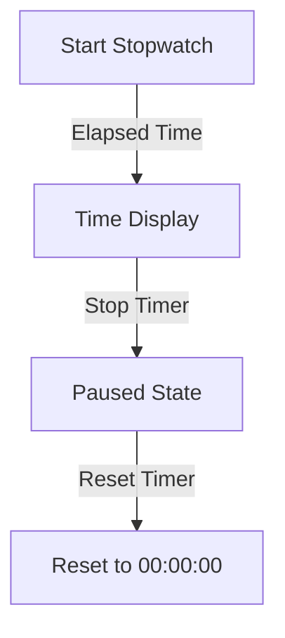

# ⏱️ **Simple Stopwatch - README**

Welcome to the **Simple Stopwatch Script**! This lightweight and easy-to-use script allows you to measure elapsed time with precision. Perfect for timing activities, experiments, or personal use.

---

## 🚀 **Features**
- **🎯 Start, Stop, and Reset** – Basic stopwatch functionality.
- **⏳ Elapsed Time Display** – Shows the exact time elapsed.
- **⌨️ Keyboard Controls** – Control the stopwatch using simple key inputs.
- **📜 Minimalist & Lightweight** – No unnecessary features, just what you need.

---

## 📜 **Usage**
1. **Clone the Repository**
   ```sh
   git clone https://github.com/your-repo/simple-stopwatch.git
   cd simple-stopwatch
   ```
2. **Run the Script**
   ```sh
   python stopwatch.py
   ```
3. **Controls:**
   - **Start:** Press `S`
   - **Stop:** Press `X`
   - **Reset:** Press `R`
   - **Exit:** Press `Q`

---

## 📊 **Performance Metrics**
### **Stopwatch Accuracy Over Time**



---

## 🤝 **Contributing**
Want to improve the script? Feel free to fork the repo and submit pull requests!

1. **Fork the Repository** 📌
2. **Create a Branch** (`git checkout -b feature-branch`) 🌱
3. **Commit Changes** (`git commit -m "Added new feature"`) 💡
4. **Push the Branch** (`git push origin feature-branch`) 🚀
5. **Open a Pull Request** 🎯

---

Happy Timing! ⏱️🚀

